# Build modern applications with Distributed Application Runtime (Dapr)

## Overview

### About us

Co-Presenter Name

☁️ *Co-Presenter Title*

> For questions or help with this series: <msusdev@microsoft.com>

All demos and source code available online:

> <https://github.com/msusdev/e2e_paas>

## Setting the scene

### Series roadmap

* ~~Session 1:~~
  * ~~Extend applications with Azure Functions and API Management~~
* ~~Session 2:~~
  * ~~Connect applications together with Azure Logic Apps and Event Grid~~
* **Session 3:**
  * **↪️ Build modern applications with Distributed Application Runtime (Dapr)**
* Session 4:
  * Deploy application infrastructure as code

### Today's agenda

1. Overview of Dapr
1. Initialize Dapr locally
1. Use a Redis state store
1. Invoke Python HTTP API
1. Invoke Node HTTP API
1. Use a PubSub broker
1. Use a secret store

## Overview of Dapr

### 

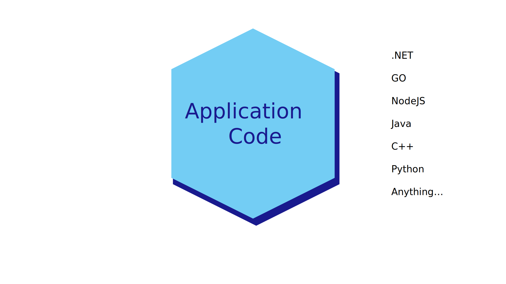

###

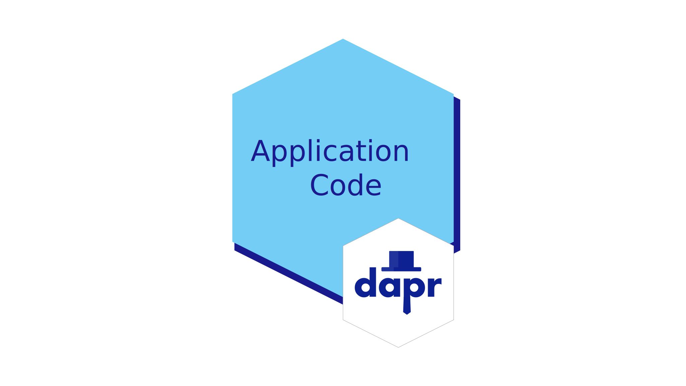

###


###

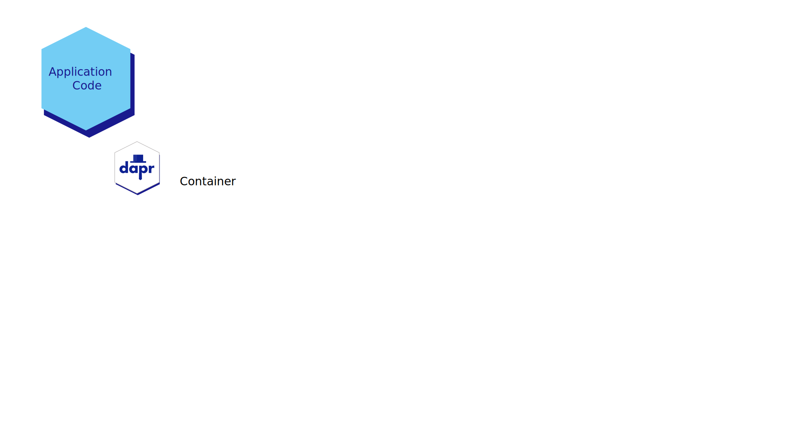

###

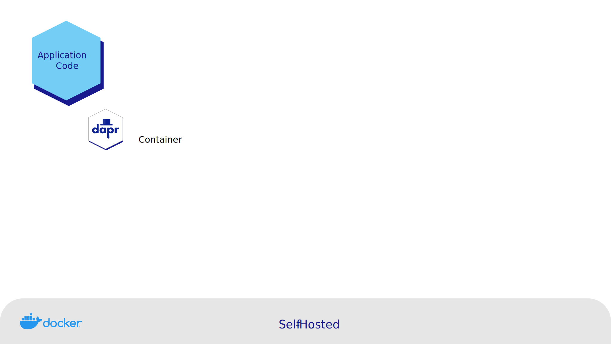

###

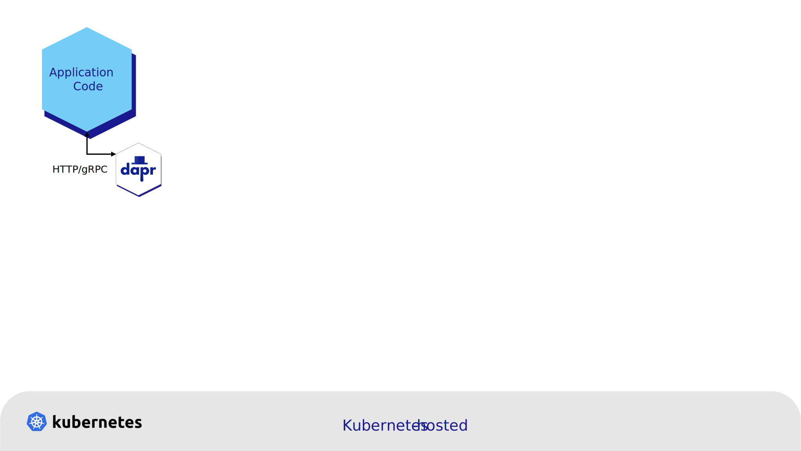

###

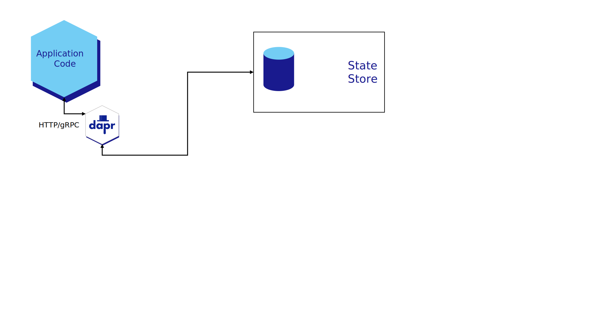

###

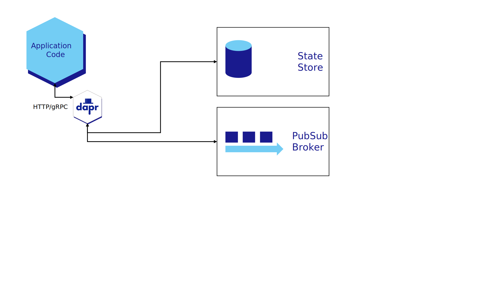

###

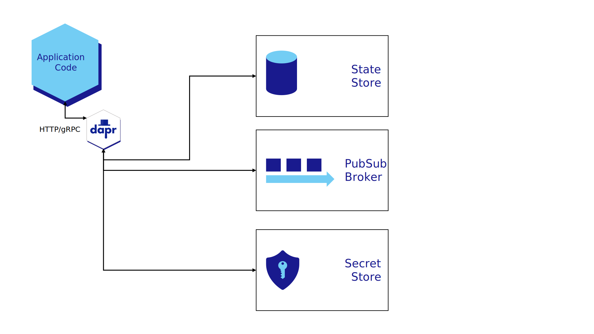

###

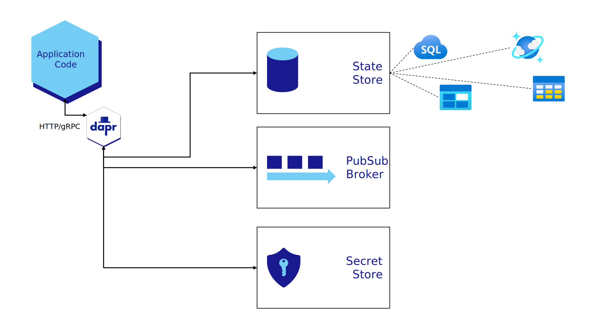

###

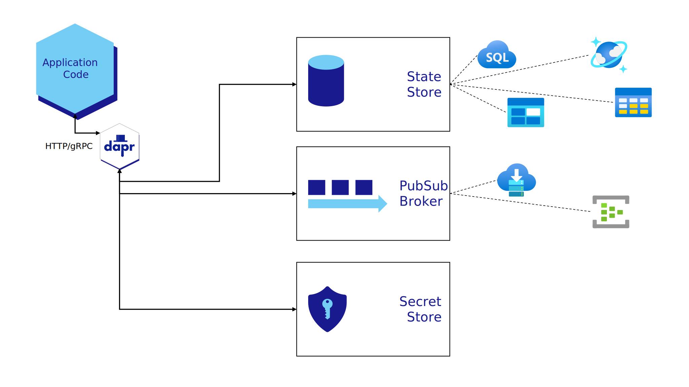

###

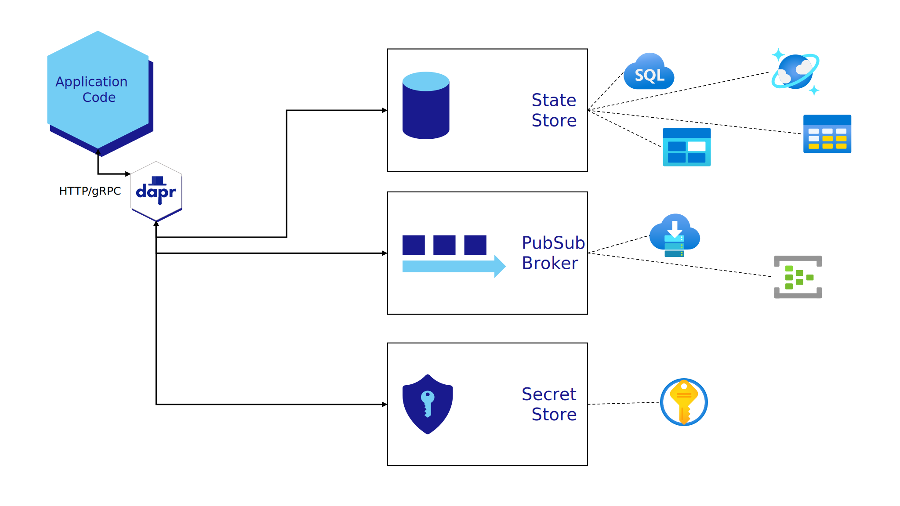

## Demo: Initialize Dapr locally

::: notes

```bash
dapr init

dapr --version

docker ps

explorer "%USERPROFILE%\.dapr\"
```

:::

## Demo: Use a Redis state store

::: notes

```bash
dapr run --app-id demo --dapr-http-port 3535
```

| HTTP VERB | URI | BODY |
| --: | --- | --- |
| POST | http://localhost:3535/v1.0/state/statestore | ``[ { "key": "name", "value": "value" } ]`` |
| GET | http://localhost:3535/v1.0/state/statestore/name | |

```bash
docker exec --interactive --tty dapr_redis redis-cli

keys *

hgetall demo||name
```

:::

## Demo: Invoke Python HTTP API

::: notes

```bash
pip install flask
```

```python
from flask import Flask
app = Flask(__name__)

@app.route('/add', methods=['POST'])
def add():
    return "Added!"

if __name__ == '__main__':
    app.run()
```

```bash
dapr run --app-id cart --dapr-http-port 3636 --app-port 5000 python test.py
```

| HTTP VERB | URI | BODY |
| --: | --- | --- |
| POST | http://localhost:3636/v1.0/invoke/cart/method/add | |

```bash
dapr invoke --app-id cart --method add

dapr list
```

:::

## Demo: Invoke Node HTTP API

::: notes

```json
{
  "name": "dapr",
  "main": "app.js",
  "type": "module",
  "scripts": {
    "start": "node app.js"
  }
}
```

```bash
npm install express --save
```

```javascript
import express from 'express';

const app = express();

app.get('/test', (req, res) => {
    res.send('Hello, Webinar!');
});

app.listen(3000);
```

```bash
dapr run --app-id service --dapr-http-port 3737 --app-port 3000 npm run start
```

| HTTP VERB | URI | BODY |
| --: | --- | --- |
| GET | http://localhost:3737/v1.0/invoke/service/method/test | |

```javascript
import express from 'express';

const app = express();
const port = 3000;

app.use(express.json());

app.get('/test', (req, res) => {
    res.send('Hello, Webinar!');
});

app.post('/echo', (req, res) => {
    let name = req.body.name ?? 'Person';
    res.send(`Hello, ${name}!`);
});

app.listen(port);
```

> **CTRL+C**

```bash
dapr run --app-id service --dapr-http-port 3737 --app-port 3000 npm run start
```

| HTTP VERB | URI | BODY |
| --: | --- | --- |
| POST | http://localhost:3737/v1.0/invoke/service/method/echo | { "name": "msusdev@microsoft.com" } |

```bash
dapr invoke --app-id service --method test

dapr invoke --app-id service --method echo --data '{ \"name\": \"msusdev@microsoft.com\" }'
```

```json
{
    "name": "msusdev@microsoft.com"
}
```

```bash
dapr invoke --app-id service --method echo --data-file .\input.json
```

:::

## Demo: Use a PubSub broker

::: notes

```json
{
  "name": "dapr",
  "main": "app.js",
  "type": "module",
  "scripts": {
    "start": "node app.js"
  }
}
```

```bash
npm install express --save
```

```javascript
import express from 'express';

const app = express();
const port = 4000;

app.use(express.json({ type: 'application/cloudevents+json' }));

app.get('/dapr/subscribe', (req, res) => {
    res.json([
        {
            pubsubname: 'pubsub',
            topic: 'greetings',
            route: 'greeting/receive'
        }
    ]);
});

app.post('/greeting/receive', (req, res) => {
    console.log(req.body);
    res.sendStatus(200);
});

app.listen(port, () => {
    console.log(`app listening on port ${port}`);
});
```

```bash
dapr run --app-id listener --dapr-http-port 3838 --app-port 4000 npm start

dapr run --app-id talker --dapr-http-port 3939

dapr publish --publish-app-id talker --pubsub pubsub --topic greetings --data '{\"message\":\"Go, World!\""}'
```

:::

## Demo: Use a secret store

::: notes

```json
{
    "sql-connection-string": "Server=(localdb)\\v11.0;Integrated Security=true;",
    "cosmos-connection-string": "AccountEndpoint=https://localhost:8081/;AccountKey=C2y6yDjf5/R+ob0N8A7Cgv30VRDJIWEHLM+4QDU5DE2nQ9nDuVTqobD4b8mGGyPMbIZnqyMsEcaGQy67XIw/Jw==;"
}
```

```yaml
apiVersion: dapr.io/v1alpha1
kind: Component
metadata:
  name: credstore
spec:
  type: secretstores.local.file
  version: v1
  metadata: 
  - name: secretsFile
    value: secrets.json
```

```bash
dapr run --app-id secrets --dapr-http-port 4040 --components-path .\secret-component\
```

| HTTP VERB | URI | BODY |
| --: | --- | --- |
| GET | http://localhost:3838/v1.0/secrets/credstore/sql-connection-string | |
| GET | http://localhost:3838/v1.0/secrets/credstore/cosmos-connection-string | |

```json
{
  "name": "dapr",
  "main": "app.js",
  "type": "module",
  "scripts": {
    "start": "node app.js"
  }
}
```

```bash
npm install node-fetch --save
```

```javascript
import fetch from 'node-fetch';

const setting = 'sql-connection-string';

let response = await fetch(`http://localhost:3838/v1.0/secrets/credstore/${setting}`);
let json = await response.json();
console.log(`Setting: [${setting}]\t${json[setting]}`);
```

:::
